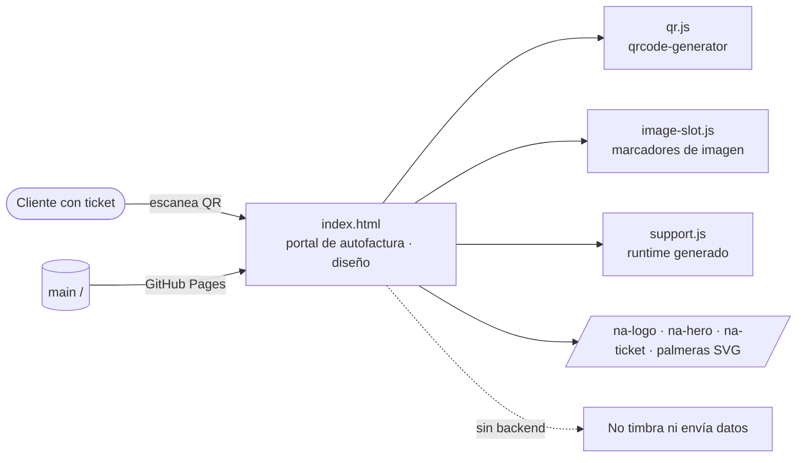

<p align="center">
  
</p>

<h1 align="center">Portal 100% Natural · vista previa de diseño</h1>

<p align="center"><b>Vista previa estática del portal de autofactura de 100% Natural</b></p>

<p align="center">
  
  
</p>

Vista previa estática, en una sola página, del diseño del **portal de autofactura de 100% Natural**. Está pensada para que el comercio, ventas y operación revisen el flujo antes de construir el producto. El cliente escanea el QR de su ticket, captura sus datos fiscales y recibe su factura ("Tu factura, en dos pasos"). La página muestra ese flujo con la paleta de palmeras y verdes de la marca, un generador de QR del lado del cliente y la sección de preguntas frecuentes. Es **solo diseño**: no emite ni timbra facturas. La guía del paquete promocional está en [`docs/PROMO-PACKAGE-IMPLEMENTATION-GUIDE.md`](docs/PROMO-PACKAGE-IMPLEMENTATION-GUIDE.md).

## Arquitectura



## Stack

- HTML y CSS estáticos, sin paso de build
- JavaScript: `qr.js` (qrcode-generator 1.4.4, minificado), `support.js` (runtime generado) e `image-slot.js`
- Recursos de marca en PNG y SVG (logos, héroe, ticket y palmeras)

## Estructura del proyecto

```text
index.html          página de vista previa
support.js  qr.js  image-slot.js
na-logo.png  na-logo-tinta.png  na-hero.png  na-ticket.png  na-palmera.png
palmera-*.svg       palmeras (bosque, crema, pizarra, verde)
docs/PROMO-PACKAGE-IMPLEMENTATION-GUIDE.md
```

## Desarrollo local

No hay dependencias ni scripts. Basta con servir la carpeta de forma local.

```bash
# Luego abre http://localhost:8000
python3 -m http.server 8000
```

## Despliegue

GitHub Pages publica la rama `main` (raíz) en https://friskydevelopments.github.io/portal-100-natural-preview/.
